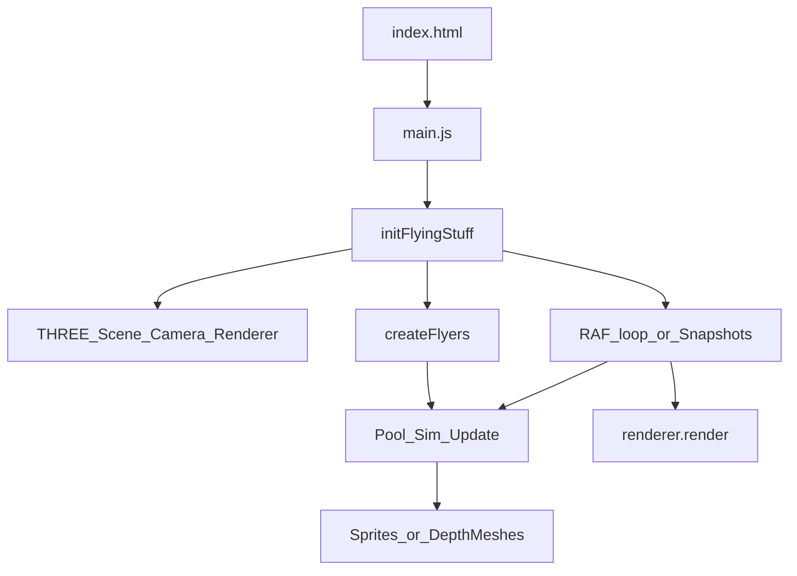

# Flying stuff architecture

This experiment is intentionally “zero-build”: it runs as **plain ES modules** and loads Three.js from a CDN importmap.

## High-level flow

## Ownership & responsibilities

- **`main.js`**
  - Creates the app by calling `initFlyingStuff({ container })`.
  - Manages UI chrome auto-hide (HUD + credit link).
  - Owns user-facing fallback error UI for startup/runtime failures.

- **`app.js`**
  - Creates core Three.js objects:
    - `THREE.Scene` (background + fog)
    - `THREE.PerspectiveCamera`
    - `THREE.WebGLRenderer`
  - Creates `flyers` by calling `createFlyers(scene, camera, config)`.
  - Wires debug UI inputs to `flyers` setters (count/speed/size + theme changes).
  - Owns the render loop:
    - per-frame: update cyclers → `flyers.update(dtMs)` → `renderer.render(scene, camera)`
  - Implements `prefers-reduced-motion` behavior: disables RAF and uses snapshot renders for interaction feedback.

- **`flyers.js`**
  - Owns the “world entities”:
    - a pool of renderables (sprites or depth meshes)
    - spawn/respawn cadence
    - per-object motion + drift + rotation
  - Handles interaction:
    - raycast hit testing against the flyer group
    - “splat” mode (swap texture, scale up, fade out, then respawn)
  - Handles theme changes:
    - `setEmojiTheme` (immediate)
    - `setEmojiThemeForNewSpawns` (spawn-only)
    - `transitionEmojiTheme` (crossfade via “ghost” renderables)
  - Includes performance guardrails:
    - caching textures/materials
    - sparkle budget + far-Z culling for expensive sparkle updates

## Public API contracts

### `initFlyingStuff({ container })`

Creates and starts the experiment. Returns an object with:

- **`dispose()`**: stops animation, unsubscribes listeners, disposes GPU resources, and removes the canvas.
- **`showFallback()`**: reveals the fallback UI (used on WebGL init failures).

### `createFlyers(scene, camera, opts)`

Creates a `THREE.Group` under `scene` and returns an object used by `app.js`:

- **Simulation**: `update(deltaMs)`
- **Interaction**: `trySplatAtNdc(ndcX, ndcY)`
- **Tuning**:
  - `setCountTarget(count, { rampSeconds })`
  - `setSpeedTarget(speed, { rampSeconds })`
  - `setSizeTarget(size, { rampSeconds })`
- **Theming**:
  - `setEmojiTheme({ emojiList, emojiStyleByEmoji, effects })`
  - `setEmojiThemeForNewSpawns({ ... })`
  - `transitionEmojiTheme({ ... }, { durationMs })`
- **Cleanup**: `dispose()`

Important invariants:

- `update()` is **hot path** (called every frame). Avoid adding allocations/logs here.
- “Theme” changes generally:
  - update cached atlas/textures
  - optionally restyle existing pool
  - keep rendering stable (no spikes) by caching and budgeting

## Performance notes

- **Texture caching**: emoji/glyph textures are cached and keyed by styling params, so palette changes don’t rebuild everything constantly.
- **Sparkle budget**: orbiting “firefly” sparkles are capped and culled at far Z to prevent trig-heavy updates dominating.
- **Reduced motion**: RAF is disabled entirely to respect user preference; interactive feedback is via a few scheduled snapshot renders.

